# String-in-C++
```Library``` for ```String``` in ```C++```.

<br>

# Author
## [Usama Azad](https://github.com/Usama-Azad/)
<br/>


### *Definations:*
``` cpp
#define __version__ "1.0.0"
#define __author__ "Usama Azad"


#define NONE            ""
#define digits          "0123456789"
#define octdigits       "01234567"
#define hexdigits       "0123456789abcdefABCDEF"
#define operators       "+-*/^%!&|"
#define printable       "0123456789abcdefghijklmnopqrstuvwxyzABCDEFGHIJKLMNOPQRSTUVWXYZ!\"#$%&'()*+,-./:;<=>?@[\\]^_`{|}~"
#define punctuation     "!\"#$%&'()*+,-./:;<=>?@[\\]^_`{|}~"
#define special_chars   "#&$!%@?~^|<>(){}[]+-*\\/=_.,:;`'\""
#define ascii_letters   "abcdefghijklmnopqrstuvwxyzABCDEFGHIJKLMNOPQRSTUVWXYZ"
#define ascii_lowercase "abcdefghijklmnopqrstuvwxyz"
#define ascii_uppercase "ABCDEFGHIJKLMNOPQRSTUVWXYZ"
```

<br>

### *All Methods List:*
``` cpp
string()            

string(const char *)

string(const __STDSTRING__)

string(const __BOOL__)   

string(const __CHAR__)   

string(const __DOUBLE__) 

string(const __FLOAT__)  

string(const __LDOUBLE__) 

string(const __INT__)         

string(const __LONG__)        

template<typename type>
string(const std::initializer_list<type>);

operator int();

operator long();

operator bool();

operator char();

operator float();

operator double();

operator long double();

operator std::string();

explicit operator const char* ();

__INT__         to_int();                           
    
__LONG__        to_long();                         

__BOOL__        to_bool();                         

__CHAR__        to_char();                        

__FLOAT__       to_float();                       

__DOUBLE__      to_double();                     

__LDOUBLE__     to_longdouble();            

__STDSTRING__   to_std_string();    

template<typename T>
T convert();

__BOOL__ is_space();
    
__BOOL__ is_upper();

__BOOL__ is_lower();

__BOOL__ is_alpha();

__BOOL__ is_alnum();

__BOOL__ is_numeric();

__BOOL__ is_contain_space();

__BOOL__ is_contain(const char* = special_chars);

__BOOL__ is_None() const;

__BOOL__ endswith(__STDSTRING__, __BOOL__ = true);

__BOOL__ startswith(__STDSTRING__, __BOOL__ = true);

__INT__ find_str(__STDSTRING__, __INT__ = 0, __BOOL__ = true);

__INT__ count(__CHAR__);

template<typename T>
__MYSTRING_REF__ getLine(basic_istream<__CHAR__, T>&, __CHAR__ = 0x00A, const char* = NULL);


#if __cplusplus >= 201102L

    void strip();

    __MYSTRING_REF__ trim();

    __MYSTRING_REF__ ltrim();

    __MYSTRING_REF__ rtrim();

#endif


__MYSTRING_REF__ title();

__MYSTRING_REF__ reverse();

__MYSTRING_REF__ swapcase();

__MYSTRING_REF__ capitalize();

__MYSTRING_REF__ toUpperCase();

__MYSTRING_REF__ toLowerCase();

__MYSTRING_REF__ replace(__CHAR__, __CHAR__);

__MYSTRING_REF__ replace_first(__CHAR__, __CHAR__);

__MYSTRING_REF__ replace(__STDSTRING__, __STDSTRING__);

__MYSTRING_REF__ replace_first(__STDSTRING__, __STDSTRING__);

__MYSTRING_REF__ format(const std::vector<string>&);

__MYSTRING_REF__ fill(__INT__, __INT__, __CHAR__);

__MYSTRING_REF__ zfill(__INT__, __CHAR__ = '0', __BOOL__ = true);

__MYSTRING_REF__ slice(__INT__ = 0, __INT__ = 0, __INT__ = 0);

__MYSTRING_REF__ join(const usa::string&, string = "");

__MYSTRING_REF__ join(std::vector<__CHAR__>, string = "", __BOOL__ = true);

__MYSTRING_REF__ join(std::vector<string>, string = "", __BOOL__ = true);

__MYSTRING_REF__ join(std::vector<__STDSTRING__>, string = "", __BOOL__ = true);

__MYSTRING_REF__ join(std::initializer_list<string>, string = "", __BOOL__ = true);

template <size_t n>
__MYSTRING_REF__ join(string(&)[n], string = "", __BOOL__ = true);

template <size_t n>
__MYSTRING_REF__ join(__STDSTRING__(&)[n], string = "", __BOOL__ = true);

vector<__STDSTRING__> split(const char* = " ");

vector<__STDSTRING__> splitlines();
      

#if __cplusplus > 201103L

    #if __cplusplus >= 201402L

        usa::string operator""x(const char*, size_t);

    #else

        std::string operator""x(const char*, size_t);

    #endif

#endif
```
<br>

### *Constructors:*

<br>

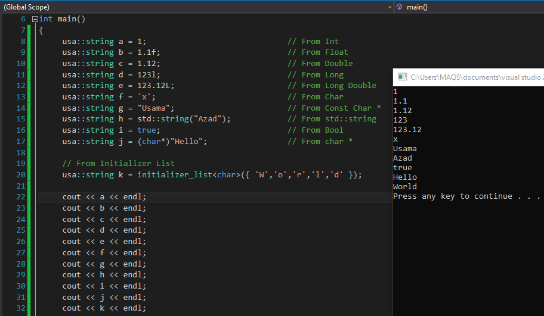

<br>

### *Operators:*

<br>

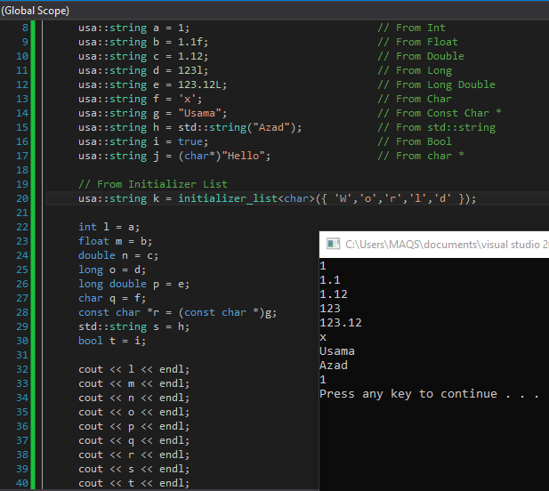

<br>

### *IntraConvertable:*

<br>

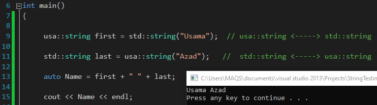

<br>

### *convert<>()*
``` cpp
        /***********************************************************************
         * @name convert
         * @brief Take typename as template parameter T and try to convert the
         * usa::string to given type T and if conversion is not possible it throws
         * runtime error.
         * @param T: template parameter T which is typename.
         * @return Any : ? Return converted string if possible
         * else `throw runtime error`.
        ************************************************************************/
        template<typename T>
        T convert();
        /************************************************************************/
```
<br>

### *convert Example:*

<br>

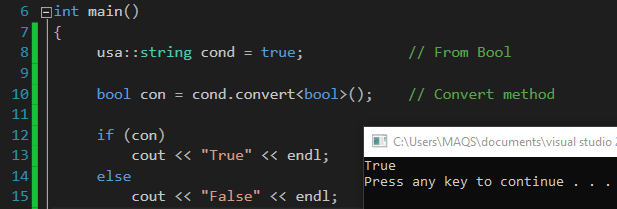

<br>

### *is_space()*
``` cpp
        /***********************************************************************
         * @name is_space
         * @brief A string is whitespace if all characters in the string
         * are whitespace and string is not empty.
         * @return bool : Return true if the string is a whitespace string, 
         * else false.
        ************************************************************************/
        __BOOL__ is_space();
        /************************************************************************/
```
<br>

### *is_upper()*
``` cpp
        /***********************************************************************
         * @name is_upper
         * @brief A string is uppercase if all cased characters in a string 
         * are uppercase and string is not empty.
         * @return bool : Return true if the string is an uppercase string, 
         * else false.
        ************************************************************************/
        __BOOL__ is_upper();
        /************************************************************************/
```
<br>

### *is_lower()*
``` cpp
        /***********************************************************************
         * @name is_lower
         * @brief A string is lowercase if all cased characters in the string 
         * are lowercase and string is not empty.
         * @return bool : Return true if the string is a lowercase string, 
         * else false.
        ************************************************************************/
        __BOOL__ is_lower();
        /************************************************************************/
```
<br>

### *is_alpha()*
``` cpp
        /***********************************************************************
         * @name is_alpha
         * @brief A string is alphabetic if all characters in the string are 
         * alphabetic and string is not empty.
         * @return bool : Return true if the string is an alphabetic string, 
         * else false.
        ************************************************************************/
        __BOOL__ is_alpha();
        /************************************************************************/
```
<br>

### *is_alnum()*
``` cpp
        /***********************************************************************
         * @name is_alnum
         * @brief A string is alpha Numeric if all characters in the string are
         *  alpha Numeric and string is not empty.
         * @return bool : Return true if the string is an alpha Numeric string,
         * else false.
        ************************************************************************/
        __BOOL__ is_alnum();
        /************************************************************************/
```
<br>

### *is_numeric()*
``` cpp
        /***********************************************************************
         * @name is_numeric
         * @brief A string is numeric if all characters in the string are numeric
         * and and string is not empty.
         * @return bool : Return true if the string is a numeric string,
         * else false.
        ************************************************************************/
        __BOOL__ is_numeric();
        /************************************************************************/
```
<br>

### *is_contain_space()*
``` cpp
        /***********************************************************************
         * TODO Add optional arguments start and end for slicing.
         * @name is_contain_space
         * @return bool : Return true if any char in string is space,
         * else false.
        ************************************************************************/
        __BOOL__ is_contain_space();
        /************************************************************************/
```
<br>

### *is_contain_space()*
``` cpp
        /***********************************************************************
         * TODO Add optional arguments start and end for slicing.
         * @name is_contain
         * @brief take type of chars are return true if string contain those chars,
         * else false.
         * @param type: contain which type of character.
         * @example usa::string("C++ is awesome!").is_contain(punctuation);
         * @return bool : Return true if the string contains given type of characters,
         * else false.
        ************************************************************************/
        __BOOL__ is_contain_space(const char* type);
        /************************************************************************/
```
<br>

### *is_None()*
``` cpp
        /***********************************************************************
         * @name is_None
         * @brief A string is None if it is empty.
         * @return bool : Return true if the string is empty, else false.
        ************************************************************************/
        __BOOL__ is_None() const;
        /************************************************************************/
```
<br>


### *is_\* Functions Example:*

<br>

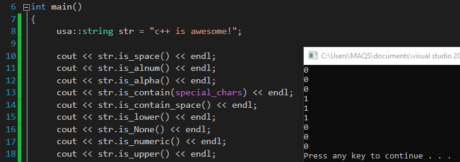

<br>


### *endswith()*
``` cpp
        /***********************************************************************
         * TODO Add optional arguments start and end for slicing.
         * @name endswith
         * @param str: suffix which is to be compared.
         * @param match_case: (By default 'true') if true then compared cases 
         * of the character with the charcter present in orignal string, 
         * but if it is false then only characters are compared without comparing 
         * the case of character.
         * @return bool : Return true if string ends with the specified suffix,
         * else false.
        ************************************************************************/
        __BOOL__ endswith(__STDSTRING__ str, __BOOL__ match_case = true);
        /************************************************************************/
```
<br>

### *startswith()*
``` cpp
        /***********************************************************************
         * TODO Add optional arguments start and end for slicing.
         * @name startswith
         * @param str: suffix which is to be compared.
         * @param match_case: (By default 'true') if true then compared cases
         * of the character with the charcter present in orignal string,
         * but if it is false then only characters are compared without comparing
         * the case of character.
         * @return bool : Return true if string starts with the specified suffix,
         * else false.
        ************************************************************************/
        __BOOL__ startswith(__STDSTRING__ str, __BOOL__ match_case = true);
        /************************************************************************/
```
<br>

### *find_str()*
``` cpp
        /***********************************************************************
         * @name find_str
         * @param str: substring which is to be compared.
         * @param pos: position from where start comparasion.
         * @param match_case: (By default 'true') if true then compared cases
         * of the character with the charcter present in orignal string,
         * but if it is false then only characters are compared without comparing
         * the case of character.
         * @return int : Return the lowest index in string where substring is found,
         * Return -1 on failure.
        ************************************************************************/
        __INT__ find_str(__STDSTRING__ str, __INT__ pos = 0, __BOOL__ match_case = true);
        /************************************************************************/
```
<br>

### *count()*
``` cpp
        /***********************************************************************
         * TODO Add optional arguments start and end for slicing.
         * @name count
         * @param ch: character which occurrences count from the given string.
         * @return int : Return the number of occurrences of character @c 'ch'
         * in string.
        ************************************************************************/
        __INT__ count(__CHAR__ ch);
        /************************************************************************/
```
<br>

### *startswith, endswith, find_str & count Example:*

<br>

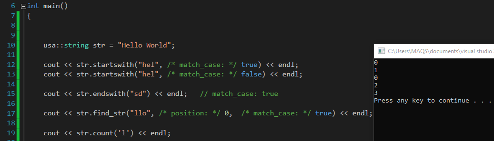

<br>


### *getLine()*
``` cpp
        /***********************************************************************
         * @name getLine
         * @brief String extraction, Read value from given stream and 
         * stores it into string.
         * @param in: A character array in which to store the data.
         * @param delim: A "stop" character. (By default 'newline')
         * @param msgtobeprint: if given then it printed on console before
         * taking input from console.
         * @return usa::string& : Return a refrence of input string.
        ************************************************************************/
        template<typename T>
        __MYSTRING_REF__ getLine(basic_istream<__CHAR__, T>& in, __CHAR__ delim = 0x00A, const char* msgtobeprint = NULL);
        /************************************************************************/
```
<br>

### *getLine Example:*

<br>

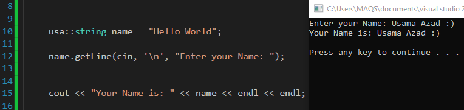

<br>

### *join()*
``` cpp
        /***********************************************************************
         * @name join
         * @overload +6
         * @brief Concatenate array of string with orignal string with delimeter.
         * @param Any: ? Overloaded.
         * @param delimiter: By which two strings are joined. (By default "")
         * @param swd: start with delimeter if it is true concatination starts with
         * delimeter, else start with given array's element (By default 'true')
         * @return usa::string& : Return a refrence of Concatenated string.
        ************************************************************************/

        __MYSTRING_REF__ join(const usa::string& obj, string delimiter = "");

        __MYSTRING_REF__ join(std::vector<__CHAR__> arr, string delimiter = "", __BOOL__ swd = true);

        __MYSTRING_REF__ join(std::vector<string> arr, string delimiter = "", __BOOL__ swd = true);

        __MYSTRING_REF__ join(std::vector<__STDSTRING__> arr, string delimiter = "", __BOOL__ swd = true);

        __MYSTRING_REF__ join(std::initializer_list<string> arr, string delimiter = "", __BOOL__ swd = true);

        template <size_t n>
        __MYSTRING_REF__ join(string(&arr)[n], string delimiter = "", __BOOL__ swd = true);

        template <size_t n>
        __MYSTRING_REF__ join(__STDSTRING__(&arr)[n], string delimiter = "", __BOOL__ swd = true)

        /************************************************************************/
```
<br>


### *join Example:*

<br>

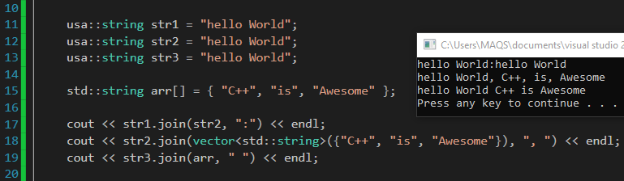

<br>


### *trim(), ltrim(), rtrim(), strip()*
``` cpp
#if __cplusplus >= 201102L

        /***********************************************************************
         * TODO If chars is given, remove characters from string instead.
         * @name trim, ltrim, rtrim, strip
         * @return usa::string& : Return a refrence of the string with leading
         * and trailing whitespace remove.
         *
         * @ltrim: it only trims only left spaces.
         * @rtrim: it only trims only right spaces.
         * @trim: it trims spaces from both sides.
         * @strip: it works like trim() but it does not return any thing.
        ************************************************************************/

        void strip();
        
        __MYSTRING_REF__ trim();

        __MYSTRING_REF__ ltrim();

        __MYSTRING_REF__ rtrim();

        /************************************************************************/

#endif
```
<br>

### *trim Example:*

<br>

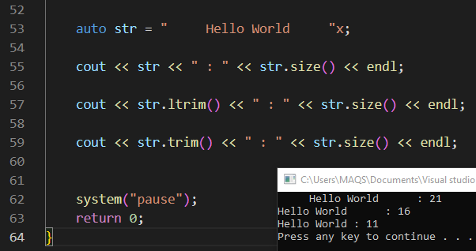

<br>

### *title()*
``` cpp
        /***********************************************************************
         * @name title
         * @return usa::string& : Return a refrence of the string where each
         * word is titlecased.

         * @brief words start with uppercased characters and all remaining cased
         * characters have lower case.
        ************************************************************************/
        __MYSTRING_REF__ title();
        /************************************************************************/
```
<br>

### *reverse()*
``` cpp
        /***********************************************************************
         * @name reverse
         * @return usa::string& : Return a refrence of the reversed string.
        ************************************************************************/
        __MYSTRING_REF__ reverse();
        /************************************************************************/
```
<br>

### *swapcase()*
``` cpp
        /***********************************************************************
         * @name swapcase
         * @brief Convert uppercase characters to lowercase and lowercase 
         * characters to uppercase.
         * @return usa::string& : Return a refrence of the swapcased string.
        ************************************************************************/
        __MYSTRING_REF__ swapcase();
        /************************************************************************/
```
<br>

### *capitalize()*
``` cpp
        /***********************************************************************
         * @name capitalize
         * @brief make the first character upper case and the rest lower case.
         * @return usa::string& : Return a refrence of the capitalized string.
        ************************************************************************/
        __MYSTRING_REF__ capitalize();
        /************************************************************************/
```
<br>

### *toUpperCase()*
``` cpp
        /***********************************************************************
         * @name toUpperCase
         * @brief all character in given string are converted into upper case.
         * @return usa::string& : Return a refrence of the UpperCased string.
        ************************************************************************/
        __MYSTRING_REF__ toUpperCase();
        /************************************************************************/
```
<br>

### *toLowerCase()*
``` cpp
        /***********************************************************************
         * @name toLowerCase
         * @brief all character in given string are converted into lower case.
         * @return usa::string& : Return a refrence of the LowerCased string.
        ************************************************************************/
        __MYSTRING_REF__ toLowerCase();
        /************************************************************************/
```
<br>


### *replace()*
``` cpp
        /***********************************************************************
         * @name replace
         * @overload +1
         * @brief replace all @c _old characters in given string with @c _new char.
         * @param _old: char which is already present in the string.
         * @param _new: new char which is replace with all @c _old chars in the string.
         * @return usa::string& : Return a refrence string with all occurrences
         * of @c _old character replaced by @c _new character.
        ************************************************************************/
        __MYSTRING_REF__ replace(__CHAR__ _old, __CHAR__ _new);
        /************************************************************************/
```
<br>

### *replace_first()*
``` cpp
        /***********************************************************************
         * @name replace_first
         * @overload +1
         * @brief replace only first occurrences of @c _old characters in given
         * string with @c _new char.
         * @param _old: char which is already present in the string.
         * @param _new: new char which is replace with only first occurrences of
         * @c _old chars in the string.
         * @return usa::string& : Return a refrence string with only first occurrences
         * of @c _old character replaced by @c _new character.
        ************************************************************************/
        __MYSTRING_REF__ replace_first(__CHAR__ _old, __CHAR__ _new);
        /************************************************************************/
```
<br>

### *replace()*
``` cpp
        /***********************************************************************
         * @name replace
         * @overload +1
         * @brief replace all @c _old substrings in given string with @c _new substring.
         * @param _old: substring which is already present in the string.
         * @param _new: new substring which is replace with all @c _old substrings
         * in the string.
         * @return usa::string& : Return a refrence string with all occurrences
         * of @c _old substrings replaced by @c _new substring.
        ************************************************************************/
        __MYSTRING_REF__ replace(__STDSTRING__ _old, __STDSTRING__ _new);
        /************************************************************************/
```
<br>

### *replace_first()*
``` cpp
        /***********************************************************************
         * @name replace_first
         * @overload +1
         * @brief replace only first occurrences of @c _old substring in given
         * string with @c _new substring.
         * @param _old: substring which is already present in the string.
         * @param _new: new substring which is replace with only first occurrences of
         * @c _old substring in the string.
         * @return usa::string& : Return a refrence string with only first occurrences
         * of @c _old substring replaced by @c _new substring.
        ************************************************************************/
        __MYSTRING_REF__ replace_first(__STDSTRING__ _old, __STDSTRING__ _new);
        /************************************************************************/
```
<br>

### *replace & replace_first Example:*

<br>

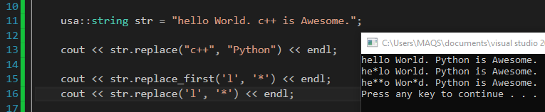

<br>

### *format()*
``` cpp
        /***********************************************************************
         * @name format
         * @brief Formatted string, using substitutions from std::vector of string.
         * The substitutions are identified by braces ('{' and '}').
         * @param arr: const vector<string>& of different args.
         * @return usa::string& : Return a formatted version of string.
        ************************************************************************/
        __MYSTRING_REF__ format(const std::vector<string>& arr);
        /************************************************************************/
```
<br>

### *format Example:*

<br>

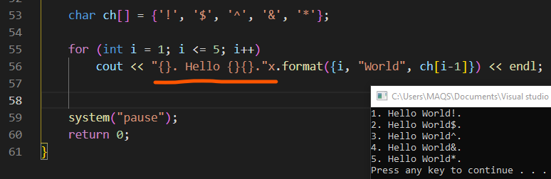

<br>

### *fill()*
``` cpp
        /***********************************************************************
         * @name fill
         * @brief fill given @c fillChar in string from @c _start to @c _end.
         * @param _start: position from where start filling.
         * @param _end: position where filling ends.
         * @return usa::string& : Return a refrence of fill string with @c fillChar
         * from @c _start to @c _end.
        ************************************************************************/
        __MYSTRING_REF__ fill(__INT__ _start, __INT__ _end, __CHAR__ fillChar);
        /************************************************************************/
```
<br>

### *zfill()*
``` cpp
        /***********************************************************************
         * @name zfill
         * @brief Pad a numeric string with @c fillChar on the left or right,
         * to fill a field of the given @c width.
         * @param width: how much paddind is required.
         * @param fillChar: character which is filled during padding. (By default '0')
         * @param fillFromStart: if true so start padding from start or left side of 
         * the string, else start padding from end or right side of the string. (By default 'true')
         * @return usa::string& : Return a refrence of padded string.
        ************************************************************************/
        __MYSTRING_REF__ zfill(__INT__ width, __CHAR__ fillChar = '0', __BOOL__ fillFromStart = true);
        /************************************************************************/
```
<br>

### *fill & zfill Example:*

<br>

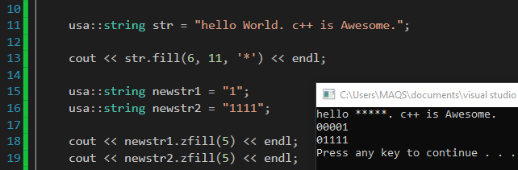

<br>

### *slice()*
``` cpp
        /***********************************************************************
         * @name slice
         * @brief Advance extended String slicing. Approximately equal to String slicing in python.
         * 
         * @param _start: from where start the slicing of string (It might be negative).
         * @param _end: from where slicing ends (It might be negative).
         * @param _step: how many characters skiped during slicing (It might be negative).
         * @return usa::string& : Return a refrence of sliced string.
        ************************************************************************/
        __MYSTRING_REF__ slice(__INT__ _start = 0, __INT__ _end = 0, __INT__ _step = 0);
        /************************************************************************/
```
<br>

### *slice Example:*

<br>

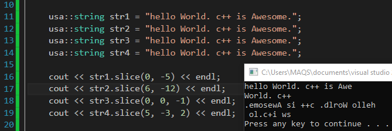

<br>

### *split()*
``` cpp
        /***********************************************************************
         * @name split
         * @brief Return a vector of the words in the string, using the delimiter to split the string.
         * The default value of delimiter (" ") means split according to any whitespace.
         * 
         * @param delimiter: By which function split the given string (By default " ").
         * @return vector std::string : Return a vector of splited tokens of string.
        ************************************************************************/
        vector<__STDSTRING__> split(const char* delimiter = " ");
        /************************************************************************/
```
<br>

### *split Example:*

<br>

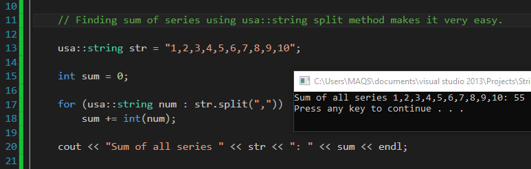

<br>

### *splitlines()*
``` cpp
        /***********************************************************************
         * @name splitlines
         * @brief use the split function with (delimiter = "\\n") so it splits the
         * string with every newline character.
         * 
         * @return vector std::string : Return a vector of splited tokens of string.
        ************************************************************************/
        vector<__STDSTRING__> splitlines();
        /************************************************************************/
```
<br>

### *usa::string literal*
``` cpp
#if __cplusplus > 201103L

    #if __cplusplus >= 201402L

        /***********************************************************************
         * @name user defined literal
         * @brief user defined literal for usa::string after C++11.
         *
         * @return usa::string || std::string : if  you have C++14 or above it
         * Return <usa::string> otherwise Return <std::string>
        ************************************************************************/
        usa::string operator""x(const char* str, size_t size);

    #else

        /***********************************************************************
         * @name user defined literal
         * @brief user defined literal for usa::string after C++11.
         *
         * @return usa::string || std::string : if  you have C++14 or above it
         * Return <usa::string> otherwise Return <std::string>
        ************************************************************************/
        std::string operator""x(const char* str, size_t size);

    #endif
    

#endif
```

### *usa::string literal Example:*

<br>

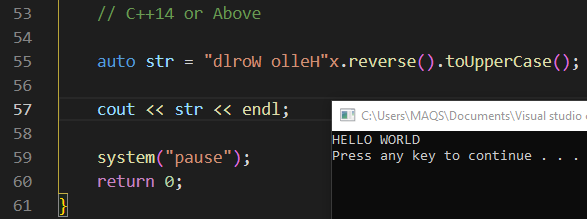

<br>